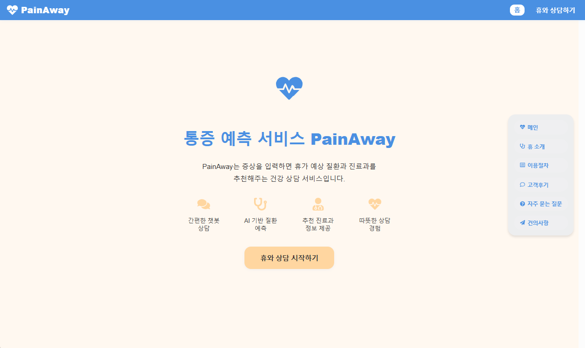
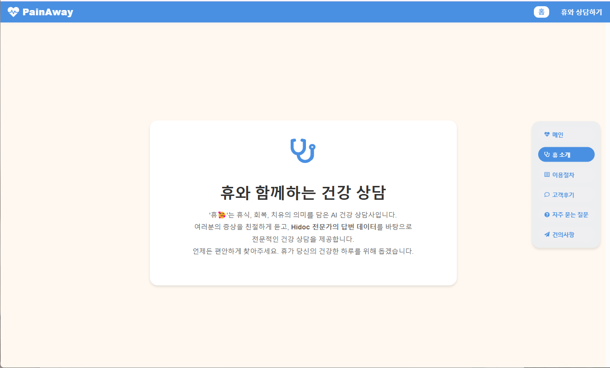
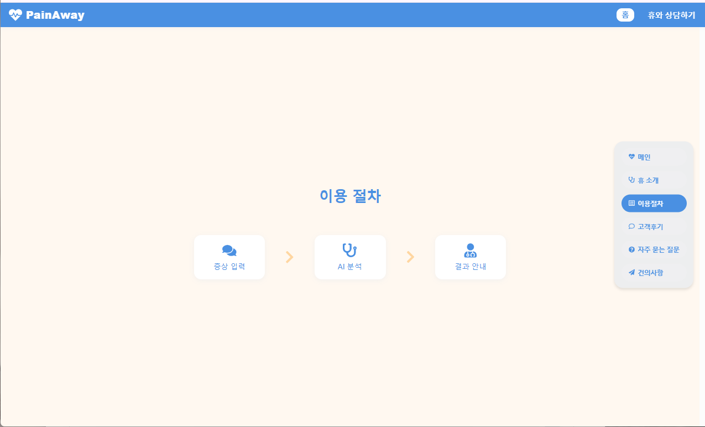
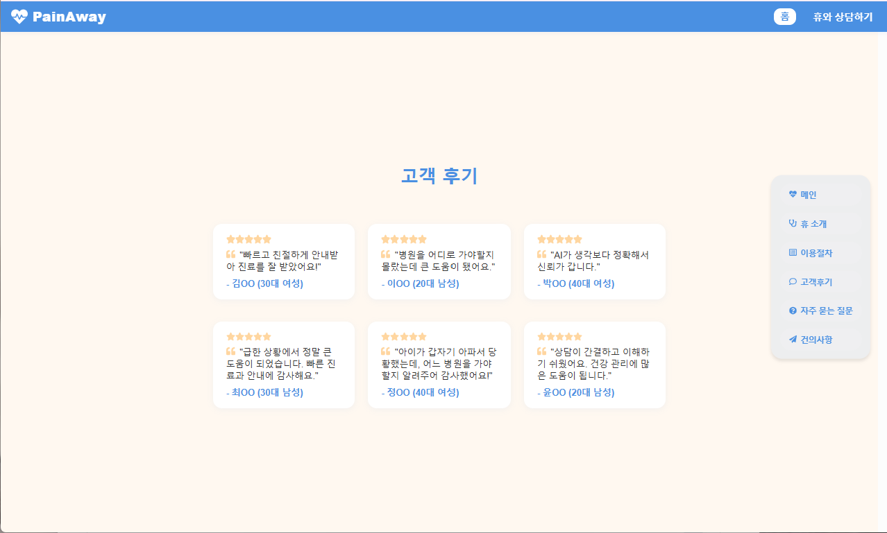
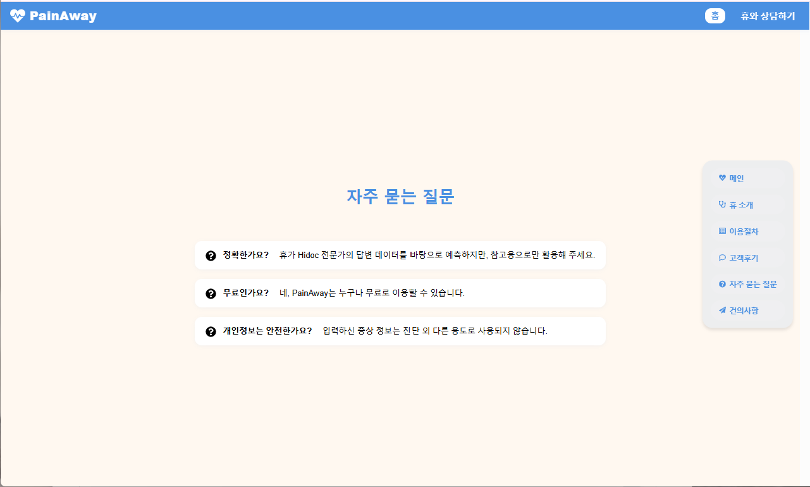
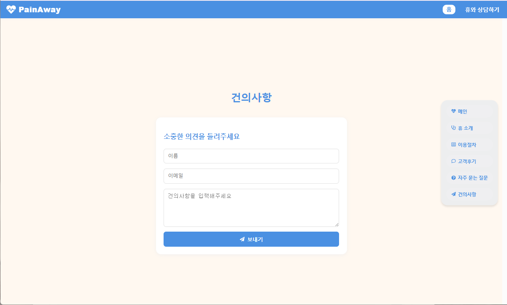
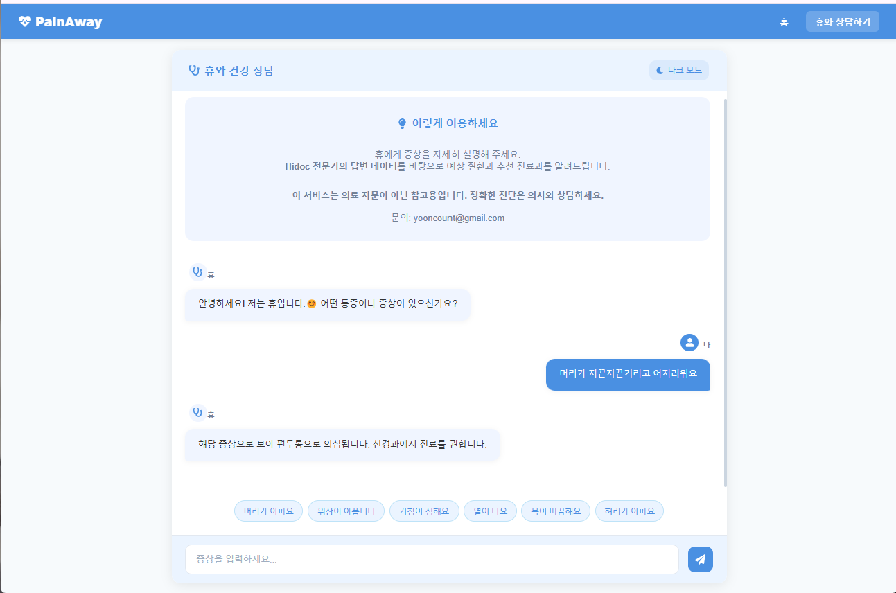

# 🩺 PainAway: 통증 기반 질환/진료과 추천 AI

PainAway는 사용자의 통증 서술을 입력받아, 관련된 질환 및 진료과를 추천해주는 인공지능 모델입니다. 
<br>의료 상담 전, 빠르게 방향성을 잡고 싶은 분들을 위한 사전 진단 보조 도구입니다.

⚠️ 주의사항

본 모델은 의료 전문가의 상담을 대체하지 않습니다.

> 이 모델은 HiDoc 웹사이트의 공개 질문·답변을 참고하여 비영리적 학습 목적으로만 사용되었으며,
> 원문 콘텐츠의 저작권은 HiDoc 및 각 작성자에게 있습니다.  
> 모델은 상업적 목적으로 사용되지 않으며 비공개 상태이나, 요청 시 삭제 조치를 취할 예정입니다.  
> 참고 링크: https://www.hidoc.co.kr
---

## 📸 서비스 화면 미리보기

| 메인 페이지 | 챗봇 휴 소개 | 이용 절차 |
|-------------|---------------|------------|
|  |  |  |

| 고객 후기 | 자주 묻는 질문 | 건의 사항 |
|------------|----------------|-------------|
|  |  |  |

| 통증 대화 페이지 |  
|------------------|
|  |  

---

## 📂 프로젝트 구조
```
LLM-painaway/
├── painaway_front/ # React 기반 프론트엔드
├── painaway-finetuning/ # 저작권 상 모델 불러오고 서버 실행하는 코드만 공개(모델, 데이터셋 비공개)
├── README.md
└── images/ # 화면 이미지 폴더
```
---

## 🧠 모델 정보

- 모델명: `저작권 상 비공개`  
- 기반 모델: `meta-llama/Meta-Llama-3.1-8B-Instruct`
- 파인튜닝 방식: LoRA (Low-Rank Adaptation)
- 프롬프트 포맷: `Instruction + Input → Response`
  
---

## 📊 데이터 정보

- 출처: **HiDoc** 웹페이지에서 공개된 통증 관련 Q&A 데이터 수집
- 구성: 사용자 질문, 전문가 답변 → Instruction 포맷으로 가공
- 형식: JSON Lines (`{"instruction": ..., "input": ..., "output": ...}`)

---
📊 예시 응답 형태
```
입력: "무릎 통증과 두통이 있습니다. 특히 앉았다 일어설 때 무릎이 아프고, 두통은 하루 종일 지속됩니다."
출력: "해당 증상으로 보아 근육통으로 의심됩니다. 근육통 진료를 권합니다."
```
## 🚀 Colab에서 실행 방법 ( 저작권 상 모델을 비공개 해두어 실행이 불가합니다 )
```
// 1. clone 
git clone -b https://github.com/ddihn/LLM-painaway
// 2. painaway-finetuning/[PainAway] 4. 모델 불러오기 및 저장 -> 파일을 Colab에서 실행 (T4 GPU 사용)
// 3. 프론트 실행
cd painaway_front
npm install
npm start

```
📧 연락

문제를 발견하신다면 연락주시기 바랍니다.

yooncount@gmail.com

---
